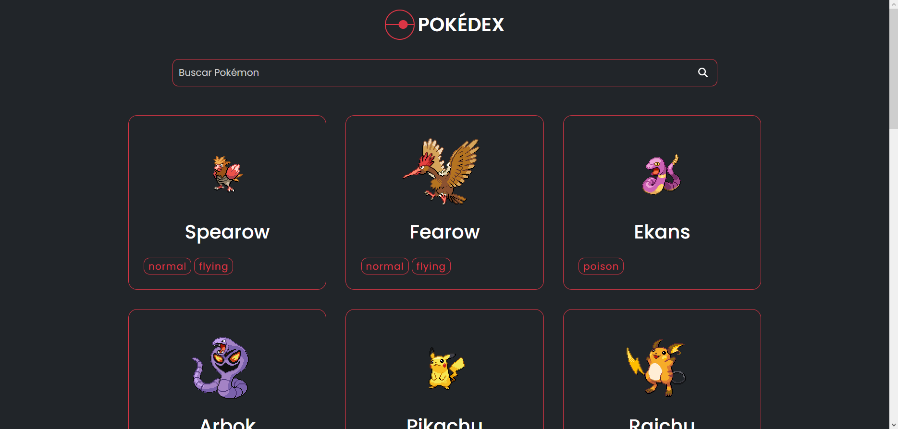

# Pokédex em Vue.js
Bem-vindo ao repositório da Pokédex desenvolvida em Vue.js! Esta é uma aplicação web que permite aos usuários explorar e buscar informações sobre diferentes espécies de Pokémon. Através desta Pokédex, você poderá visualizar detalhes de cada Pokémon, incluindo suas características, tipos, habilidades e muito mais.


<a href="https://vjrsz.github.io/pokedex-vue/">Preview</a>

## Funcionalidades
- Listas de Pokémons: Veja uma lista completa de todos os Pokémon disponíveis, com suas imagens e nomes.
- Detalhes do Pokémon: Clique em um Pokémon na lista para exibir informações detalhadas, incluindo tipo, altura, peso, habilidades e descrição.
- Responsividade: A aplicação é totalmente responsiva, garantindo uma experiência consistente em dispositivos móveis e desktop.

# Tecnologias Utilizadas
- Vue.js: Um framework JavaScript progressivo para a construção de interfaces de usuário.
  - Vue Store
  - Vue Router
- HTML5: Linguagem de marcação para estruturar a aplicação.
- CSS3: Folhas de estilo para o design e layout da aplicação.
  - Bootstrap
  - SASS
- Axios: Biblioteca para realizar requisições HTTP para a PokéAPI.
- <a href="https://pokeapi.co">PokéAPI</a>: Uma API pública que fornece informações detalhadas sobre os Pokémon.

## Como Rodar a Aplicação
Clone este repositório para o seu ambiente local usando o comando:
```
git clone https://github.com/vjrsz/pokedex-vue.git
```
Navegue até o diretório do projeto:
```
cd pokedex-vue
```
Instale as dependências necessárias com o npm (ou yarn, se preferir):
```
npm install
```
Inicie a aplicação:
```
npm run serve
```
Acesse a aplicação no seu navegador através do link:
```
http://localhost:5173/
```

## Contribuição
Se você deseja contribuir para este projeto e adicionar novos recursos, corrigir bugs ou melhorar a experiência do usuário, fique à vontade para criar um Pull Request. Sua contribuição é muito bem-vinda!

<i style="color:#f00">Certifique-se de testar sua contribuição localmente antes de submetê-la. </i>

## Autor
Este projeto foi desenvolvido com carinho por Valter Junior.

## Licença
Este projeto é licenciado sob a Licença MIT - veja o arquivo <a href="./LICENSE">LICENSE</a> para detalhes.

Divirta-se explorando a Pokédex em Vue.js! Gotta catch 'em all! 🌟🔍👾